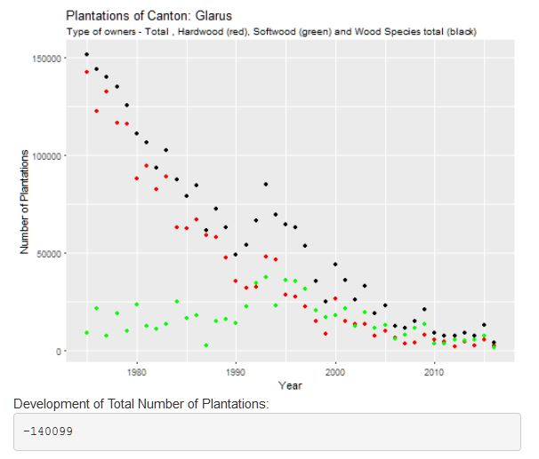

  
  
  
## 1. About Shiny app 'AssignDDP94' 

### 1.1 Assignment DDP 9.4
Coursera:         Data Science Specialization   
Course 9:         Developing Data Product  
Assignment 9.4:   Shiny App on shinyapps.io & R Presenter on Rpubs  

### 1.2 East Swiss Forest Growth and Number of Plantations Data
The application [AssignDDP94](https://mhunkeler.shinyapps.io/assignddp94/) is based on [Swiss Federal Statistical Office Data](https://www.pxweb.bfs.admin.ch/default.aspx?px_language=en) about [Forest area in Switzerland, in hectare](https://www.pxweb.bfs.admin.ch/Selection.aspx?px_language=en&px_db=px-x-0703010000_101&px_tableid=px-x-0703010000_101\px-x-0703010000_101.px&px_type=PX) and [Number of plantations in Swiss forest](https://www.pxweb.bfs.admin.ch/Selection.aspx?px_language=en&px_db=px-x-0703030000_112&px_tableid=px-x-0703030000_112\px-x-0703030000_112.px&px_type=PX).
  
The East Swiss forest data were collected from 1975 until 1986 and contains informations about the east cantons:  
**Appenzell Innerrhoden, Apenzell Ausserrhoden, Glarus, Graubuenden / Grigioni / Grischun, Schaffhausen, St. Gallen and Thurgau**.
  
### 1.2 Navbar Tab 'Plot': Widget Input Data
The input widget at the upper left corner of the tab 'Plot' creates a filter for the forest data. Chooseable input filter parameters are **Canton**, **Type of Owner** and **Date Range**.
  
  
  

  
### 1.3 Navbar Tab 'Plot': Plots
Based on the input widget choices displays the tab "Plot" two interactive plots and the calculation of:  
- Total Forest Area growth [ha]  
- Productive Area growth [ha]  
- Total Number of Plantations  
  
  
The **Plot Forests of Canton** shows the total area and the productive area of forest in hectar [ha] based on canton, type of forest owner and date range.  
  
  
  
  
The **Plot Plantations of Canton** shows the total number of plantations and the number of Hardwood (deciduous) and Softwood (conifers) plantations based on canton, type of forest owner and date range.  
  
  
  
  
### 1.4 Navbar Tab 'Table'
Based on the input widget choices displays the tab 'Table' the choosen filter and the filtered data table. As addition there is a search function available for the filtered data table.


   
  
  


## 2. Further informations: R Code, Data and Files

There is also a reproducible and executable Presentation [Swiss Forest Growth and Number of Plantations](http://rpubs.com/mhunkeler) published on Rpubs. 
  
### 2.1 Data
The [raw data](https://github.com/monika66/AssignmentDDP9_4/tree/rawdata) where pre-processed with the R script "MergeSwissForestData.R" and stored as ["ForestData.csv"](https://github.com/monika66/AssignmentDDP9_4/).  
The Shiny app 'AssignDDP94' just uses the dataframe ForestData with the 9 columns:
  
- **Year**: Date range from 1975 until 1986  
- **Canton**: Appenzell Innerrhoden, Apenzell Ausserrhoden, Glarus, Graubuenden / Grigioni / Grischun, Schaffhausen, St. Gallen and Thurgau.  
- **TypeofOwner**: Forest owner Types are *Type of owners - Total*, *Private forest* and *Public forest*. For Public Forest exists subtypes of owners called *Federal forest*, *Cantonal forest*, *Municipality forest*, *Bourgeois forest* and *Other public forest*. Note Public Forest subtypes contains only Forest Area data no Plantation data.  
- **NrofOwners**: Number of forest Owners.    
- **TotalArea**: Total forest area in hectar [ha]  
- **ProductiveArea**: Productive forest area in hectar [ha]  
- **Hardwood**: Number of Hardwood (deciduous) plantations  
- **Softwood**: Number of Softwood (conifers) plantations  
- **Total Species**: Number of Hardwood (deciduous) and Softwood (conifers) plantations    


### 2.3 Code ui.R  
  
```
# This is the user interface definition of the Shiny web application 'AssignDDP94'.
ForestData <- read.csv("ForestData.csv", header = TRUE, sep = ",", quote = "\"")

shinyUI(navbarPage("Shiny AssignDDP94",
                   tabPanel("Plot",
                            headerPanel("East Switzerland: Forest and Plantation Growth"),
                            sidebarPanel(
                              h4("Please choose input:"),
                              selectInput("canton", "Canton", choices=unique(ForestData$Canton)),
                              selectInput("ownerType", "Type of Owner", choices=unique(ForestData$TypeofOwner)),
                              dateRangeInput("dateRange", label = 'Date Range', start = "1975-01-01" , end = "2016-12-31", format = "yyyy", startview = 'year', min = "1975-01-01", max="2016-12-31")
                            ),
                            mainPanel(
                              plotOutput("swissForestPlot"),
                              p("Total Forest area growth [ha]:"),
                              verbatimTextOutput("Total"),
                              p("Productive Forest area growth [ha]:"),
                              verbatimTextOutput("Productive"),
                              plotOutput("swissPlantationPlot"),
                              p("Development of Total Number of Plantations:"),
                              verbatimTextOutput("Plantations")
                            )),
                   tabPanel("Table", verbatimTextOutput("FilterText"), DT::dataTableOutput("table")),                 
                   tabPanel("About", uiOutput("aboutFile"))
                  ))
```
  
### 2.3 Code server.R

```
# This is the server logic of the Shiny web application 'AssignDDP94'. 

# Load libraries and data
library(shiny)
library(ggplot2)
library(lubridate)
library(markdown)
library(DT)

ForestData <- read.csv("ForestData.csv", header = TRUE, sep = ",", quote = "\"")

shinyServer(function(input, output, session) {

    # Calculate for given input filter development of total forest area in [ha] 
    output$Total  <- renderText({
      TotalDiff <- as.character(ForestData[which(ForestData$Canton==input$canton & ForestData$TypeofOwner == input$ownerType & ForestData$Year==(year(input$dateRange)[2])), 5] - ForestData[which(ForestData$Canton==input$canton & ForestData$TypeofOwner == input$ownerType & ForestData$Year==(year(input$dateRange)[1])), 5])
    })
    
    # Calculate for given input filter development of productive area in [ha]
    output$Productive  <- renderText({
      ProductiveDiff <- as.character(ForestData[which(ForestData$Canton==input$canton & ForestData$TypeofOwner == input$ownerType & ForestData$Year==(year(input$dateRange)[2])), 6] - ForestData[which(ForestData$Canton==input$canton & ForestData$TypeofOwner == input$ownerType & ForestData$Year==(year(input$dateRange)[1])), 6])
    })
    
    # Swiss Forest Growth Plot
    output$swissForestPlot <- renderPlot({
      ForestData <- ForestData[(ForestData$Year>=(year(input$dateRange)[1]) & ForestData$Year<=(year(input$dateRange)[2])) , ]
      ggplot(ForestData[which(ForestData$Canton==input$canton & ForestData$TypeofOwner == input$ownerType), ]) + geom_point(aes(Year,ProductiveArea), color = "green") + geom_point(aes(Year, TotalArea), color = "blue") + xlab("Year") + ylab("Forest Area [ha]") + ggtitle(paste("Forests of Canton:", input$canton), paste(input$ownerType, ", Total Area (blue) and Productive Area (green)"))
    })
    
    # Swiss Plantations Growth Plot
    output$swissPlantationPlot <- renderPlot({
      ForestData <- ForestData[(ForestData$Year>=(year(input$dateRange)[1]) & ForestData$Year<=(year(input$dateRange)[2])) , ]
      ggplot(ForestData[which(ForestData$Canton==input$canton & ForestData$TypeofOwner == input$ownerType), ]) + geom_point(aes(Year,Hardwood), color = "red")  + geom_point(aes(Year, Softwood), color = "green") + geom_point(aes(Year, TotalSpecies), color = "black") + xlab("Year") + ylab("Number of Plantations") + ggtitle(paste("Plantations of Canton:", input$canton), paste(input$ownerType, ", Hardwood (red), Softwood (green) and Wood Species total (black) "))
      })
    
    # Calculate for given input filter development of Total Number of Plantations 
    output$Plantations  <- renderText({
      PlantationsDiff <- as.character(ForestData[which(ForestData$Canton==input$canton & ForestData$TypeofOwner == input$ownerType & ForestData$Year==(year(input$dateRange)[2])), 7] - ForestData[which(ForestData$Canton==input$canton & ForestData$TypeofOwner == input$ownerType & ForestData$Year==(year(input$dateRange)[1])), 7])
    })
    
    # Table Filter Parameters
    output$FilterText  <- renderText({
      FilterText <- paste("Filter: Canton is", input$canton)
      FilterText <- paste(FilterText, paste(", Type of Owner is", input$ownerType))
      FilterText <- paste(FilterText, paste(", Date Range is", 
                                            paste(as.character(year(input$dateRange)), collapse = " to ")
      ))
    })
    
    # Table shows filtered Data
    output$table <- DT::renderDataTable(DT::datatable({
      ForestData <- read.csv("ForestData.csv", header = TRUE, sep = ",", quote = "\"")
      data <- ForestData[ForestData$Canton==input$canton & ForestData$TypeofOwner == input$ownerType,  ]
      data <- data[(data$Year>=(year(input$dateRange)[1]) & data$Year<=(year(input$dateRange)[2])), ]
    }))
    
    output$aboutFile <- renderUI({
      file <- includeMarkdown("about.md")
    })
  })
``` 
